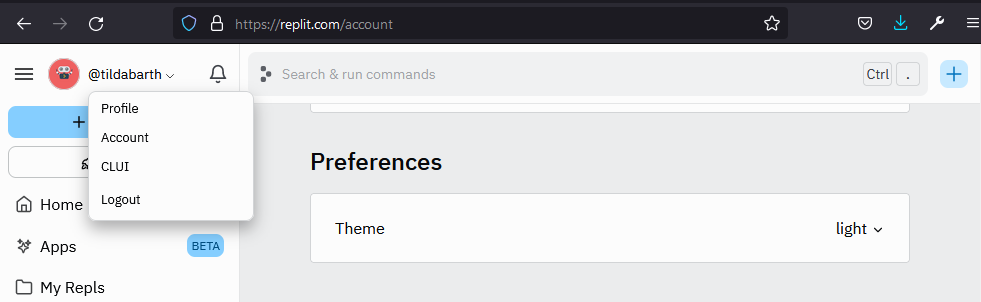
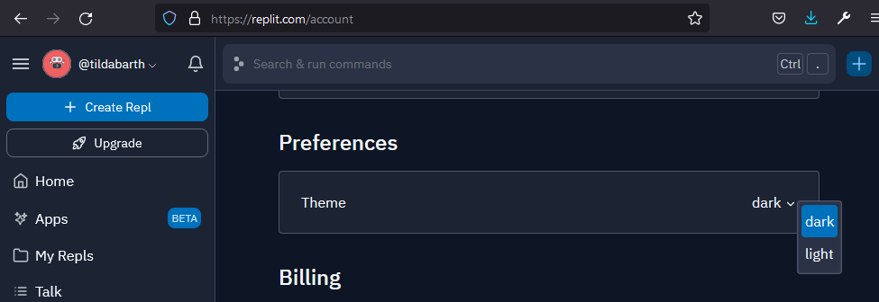

# A Basic Introduction to FastAPI
### A Pink Programming Digital Sunday Workshop

## What we'll do

- 👋 We'll start by building a very simple Hello World application to get a first taste of FastAPI.
- 🏃‍♀️ 👟 Then we'll expand the application and add *routes* and *schemas*. We'll work with two kinds of items: runs and shoes.
- 👀 We'll also have a look at the interactive documentation.
- 🖼️  Finally, we'll set up a web app to consume our API and display the data.

During the workshop, all code will be written on [Replit](https://replit.com/). You need to register an account and *fork* the workshop projects before the workshop starts. Make sure you can run them. Setting up and starting a repl can take some time so make sure you're all set when the workshop starts.

You could try and do the workshop in a local Python ≥ 3.8 virtual environment. There is a `requirements.txt` file if you don't use Poetry. Note that you may not be able to get help with setup or any issues concerning local development during the workshop.


| API App | Web App |
| ----------- | ----------- |
| [Replit](https://replit.com/@tildabarth/pink-workshop-api-start) |  [Replit](https://replit.com/@tildabarth/pink-workshop-app-start) |
| [GitHub](https://github.com/tildabarth/pink-workshop-api-start) | [GitHub](https://github.com/tildabarth/pink-workshop-app-start) |

The data we'll use is already fetched from the [Strava API](https://developers.strava.com/). On running the API app for the first time, the original data is processed and stored in `JSON` files in `/data/db`. This is so we can easily use the data with our *schemas* later on.<br>
The processed data is also backed up in `/data/backups`. If we mess up the files in `/data/db`, we can manually copy the backup data and paste it.<br>
Generally, a database would be used for data storage. However, for this workshop it's enough to store the data in files.


## ⚡ FastAPI

> FastAPI is a modern, fast (high-performance), web framework for building APIs with Python 3.6+ based on standard Python type hints. ([https://fastapi.tiangolo.com/](https://fastapi.tiangolo.com/))

[Sebastián Ramírez (@tiangolo)](https://github.com/tiangolo) made the first commit to FastAPI by the end of 2018. Today (Oct 2021) less than three years later, the project has more than 37k stars on [GitHub](https://github.com/tiangolo/fastapi).

FastAPI makes it fast and easy to develop robust API:s. The framework is intuitive and you can do a lot with few lines of code. Speeding up development as well as performance.<br>
Input and output validation is done "automagically" via **Pydantic** classes, taking advantage of Python *type hints*.<br>
FastAPI also fully supports the `async` and `await` keywords. Though we won't take advantage of the asynchronous support in this workshop.
We *will* look at, and use, the integrated and interactive documentation. This makes it super simple to test our *routes*/*endpoints*. No need for an external API platform.

## 🚀 Getting started

Before the workshop, fork (on Replit) or clone (on GitHub) the two workshop projects (`api-start` and `app-start`). Make sure you can run them.

On Replit, you simply need to *fork* the projects and then click on the big button that says **Run**. Replit will install all dependencies and set up the project. After that, you'll see the initial response in a separate viewer.


It should look something similar to:


> ### A Note on HTTP(S)
> If you during the workshop (in either project on Replit) have issues or errors referring to the page not being secure, try to replace `https://` with `http://`.<br>
It's of course not an ideal solution, but good enough if it works. We're not creating production ready applications.


We'll start with a simple template for a minimal application. This is what you run when you first start the project.

The sections on **path parameters** and **query parameters** are only for reading, you don't have to type the examples, unless you want to.

### A Minimal Application

In difference to [Flask](https://flask.palletsprojects.com/) or [Django](https://www.djangoproject.com/), FastAPI does not come with an integrated server. `uvicorn` is the (ASGI) server implementation that is used in the FastAPI [official tutorial]() and it's what we'll be using.
```py
import uvicorn
from fastapi import FastAPI
```
First we create an instance of the `FastAPI` class.
```py
app = FastAPI()
```
We then create a path operation/view function/route (`root`) and register it with the `app` instance via the *path operation decorator* (`@app.get`, for `GET` requests). In the path operation decorator, we specify the *path* of the route, in this case `'/'`, which is the server root.<br>
The function returns a dictionary with the key `'message'`. The *response body* will be converted to `JSON` (JavaScript Object Notation) when a `GET` request to the route is made. But we are still free to work with familiar Python types.
```py
@app.get('/')
async def root():
    return {'message': 'Hello FastAPI'}
```
Finally we run the server.<br>
Note that if you're on Replit, the `host` must be explicitly set to `0.0.0.0`.
```py
if __name__ == '__main__':
    uvicorn.run(app, host='0.0.0.0')
```
The finished code:
```py
import uvicorn
from fastapi import FastAPI

app = FastAPI()

@app.get('/')
async def root():
    return {'message': 'Hello FastAPI'}

if __name__ == '__main__':
    uvicorn.run(app, host='0.0.0.0')
```

The name of your view functions/routes/path operations does not matter. As long as it's unique.<br>
Note that we can use the `async` keyword without `await` as a convention.

### Reloading

We can reload the server every time a Python file is updated. Then we must pass a string with the module name and the app name: `'main:app'`. We also need to specify that `reload` is `True`:
```py
    uvicorn.run(
        'main:app',
        host='0.0.0.0',
        reload=True,
    )
```

### Path Parameters

We can have our route accept a parameter. This is then added to the *path* **and** the function parameters.
```py
@app.get('/hello/{name}')
async def hello(name: str):
    return f'Hello {name.title()}!!'
```

You can add multiple "levels" to the path. Note that the order matters. The response of the *first matching route* will be returned.
```py
@app.get('/hello/welcome')
async def welcome():
    return f'Hi there and welcome!'

@app.get('/hello/{name}')
async def hello(name: str):
    return f'Hello {name.title()}!!'
```
```
URL:       .../hello/welcome
Response:  "Hi there and welcome!"
```
```
URL:       .../hello/ada
Response:  "Hello Ada!!"
```

The above code works as expected. However, if you move `welcome` *after* `hello`, you will get `"Hello Welcome!!"`. In that case, `/hello/welcome` is matching `/hello/{name}` and `hello` is called with `'welcome'` as the value of `name`.

### Query Parameters
You can also send data via *query parameters*. Then you simply add them to the function parameters. Query parameters can be optional.

```py
@app.get('/hello')
async def hello_params(name: str = 'you'):
    return f'Hello {name.title()}!!'
```
```
URL:       .../hello
Response:  "Hello You!!"
```
```
URL:       .../hello?=ada
Response:  "Hello Ada!!"
```

There is of course much more to FastAPI than this. However, you need a basic understanding of how to use parameters to follow the workshop. We'll create multiple CRUD (Create Read Update Delete) routes to handle our items (runs and shoes).<br>
In the final web app we'll only make GET requests for simplicity. But we'll try our API CRUD routes in the interactive documentation.


### What we won't cover

#### 🔒 Security

TLDR: Don't publish your demo apps in production!

The workshop code is intentionally simplified for demonstration purposes. This means it's focused on "usability" over security.

#### 🚦 Testing

While I'm a big fan of testing, it's not within the scope of this basic workshop.

#### 🐍 Basic Python

If you don't have basic Python knowledge, you might struggle to follow along. We'll use concepts like *decorators, data classes, comprehensions* etc. However, you don't need to know these to follow the workshop.

#### 🔀 Asynchronous Python

This is a workshop topic in it self. We'll keep it simple for now. Though the convention is to use the `async` keyword even if we're not `await`:ing, so we'll use that.


## Additional Resources

### Dependencies
- [FastAPI](https://fastapi.tiangolo.com/)
- [Pydantic](https://pydantic-docs.helpmanual.io/)
- [Starlette](https://www.starlette.io/)
- [Uvicorn](https://www.uvicorn.org/)

#### Web App Specific Dependencies
- [Jinja2](https://jinja.palletsprojects.com/en/3.0.x/)
- [requests](https://docs.python-requests.org/en/master/index.html)


### Python Type Hints

If you've yet to use type hints in Python, you are in for a treat. Maybe. It's a debated topic and some people don't like the way Python does type hinting.

- [Python Type Checking (Real Python)](https://realpython.com/python-type-checking/)

- [Support for type hints (official docs)](https://docs.python.org/3/library/typing.html)

#### FastAPI ❤️ Type Hints
While type hints are optional in Python, they're an integral part of FastAPI.


### Replit Colour Theme
Change colour theme by clicking on your user name and then `Account > Preferences > Theme`


